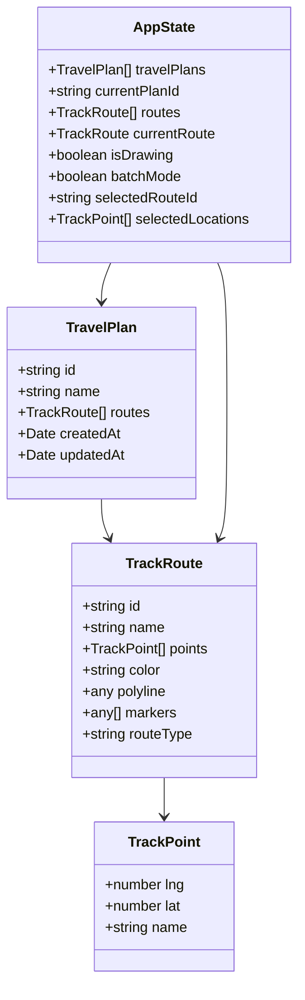
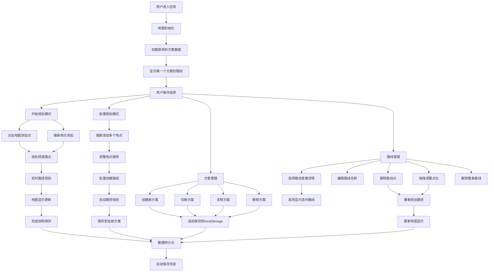
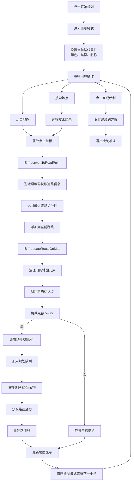
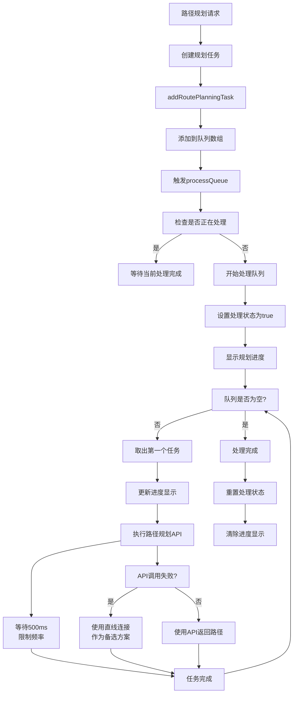
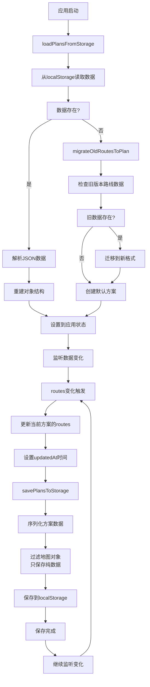
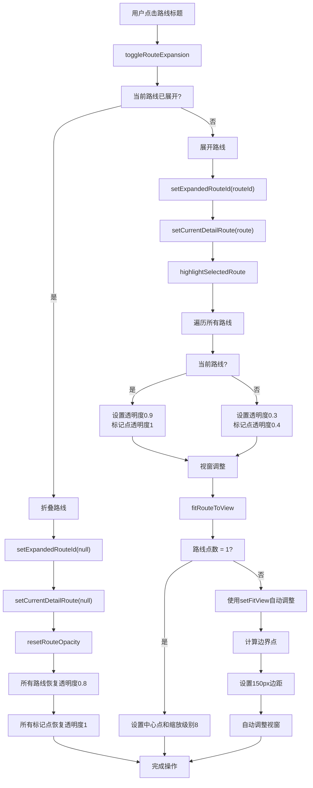

# 智能旅行路线规划应用

基于React和高德地图API的智能旅行路线规划应用，支持多方案管理、实时路径规划、批量地点添加等功能。

## 🌟 功能特性

### 核心功能
- **智能道路吸附** - 自动将点击位置转换为最近道路点，确保路径规划准确
- **多种导航模式** - 支持驾车🚗、步行🚶、骑行🚴三种路径规划模式
- **实时路径规划** - 点击或拖拽即时更新路线，支持API队列管理避免频率限制
- **多方案管理** - 创建、切换、复制、删除多个旅行方案
- **批量规划** - 一次性添加多个地点，自动按顺序规划最优路径
- **数据持久化** - 自动保存到localStorage，支持数据迁移

### 交互特性
- **拖拽优化** - 支持标记点拖拽调整，实时重新规划路径
- **智能视窗** - 自动调整地图视窗以最佳角度显示路线
- **路线高亮** - 选中路线高亮显示，其他路线半透明
- **搜索功能** - 全国范围地点搜索，支持POI和地址搜索
- **响应式设计** - 适配不同屏幕尺寸，悬浮控制面板设计

## 🏗️ 技术架构

### 数据结构设计



### 系统架构特点

#### 性能优化
- **API请求队列** - 限制并发请求(500ms/次)，避免频率限制
- **智能缓存** - 地图对象复用，减少重复创建
- **异步处理** - 路径规划和UI更新分离

#### 用户体验
- **实时反馈** - 拖拽、点击即时响应
- **进度提示** - 长时间操作显示进度条
- **智能默认** - 自动选择合适的视窗和缩放级别

#### 数据管理
- **状态分离** - 地图状态与业务数据分离
- **版本兼容** - 支持旧版本数据自动迁移
- **容错处理** - API失败时使用直线连接作为备选方案

## 📊 核心流程图

### 应用主流程



### 路线绘制流程



### API请求队列管理



### 数据持久化流程



### 路线高亮与视窗调整



## 🔧 关键算法

### 道路吸附算法
```typescript
// 使用逆地理编码将任意坐标转换为最近道路点
const convertToRoadPoint = async (lng: number, lat: number): Promise<TrackPoint> => {
  // 1. 创建逆地理编码器
  // 2. 获取最近道路信息
  // 3. 优先使用道路点，其次POI点，最后地址信息
  // 4. 返回优化后的坐标
}
```

### 视窗自适应算法
```typescript
// 智能调整地图视窗以最佳显示路线
const fitRouteToView = (route: TrackRoute) => {
  if (route.points.length === 1) {
    // 单点：设置中心点和固定缩放
    map.setZoomAndCenter(8, [point.lng, point.lat]);
  } else {
    // 多点：计算边界并自动调整
    map.setFitView(bounds, false, [150, 150, 150, 150]);
  }
}
```

### 队列控制算法
```typescript
// API请求频率控制，避免超出限制
const processRoutePlanningQueue = async () => {
  while (queue.length > 0) {
    const task = queue.shift();
    await task();
    await new Promise(resolve => setTimeout(resolve, 500)); // 限频500ms
  }
}
```

## 🚀 快速开始

### 环境要求
- Node.js 16+
- npm 或 yarn

### 安装依赖
```bash
npm install
# 或
yarn install
```

### 配置高德地图API
1. 在[高德地图开放平台](https://lbs.amap.com/)申请API Key
2. 编辑 `src/config/mapConfig.ts` 文件
3. 将 `apiKey` 替换为你的实际API Key

```typescript
export const MAP_CONFIG = {
  apiKey: '你的高德地图API Key',
  version: '2.0',
  defaultCenter: [116.397428, 39.90923],
  defaultZoom: 10,
  mapStyle: 'amap://styles/light'
};
```

### 启动开发服务器
```bash
npm start
# 或
yarn start
```

应用将在 `http://localhost:3000` 启动。

### 构建生产版本
```bash
npm run build
# 或
yarn build
```

## 📖 使用指南

### 基本操作
1. **创建路线** - 点击"开始规划"进入绘制模式
2. **添加地点** - 点击地图或使用搜索功能添加轨迹点
3. **调整路线** - 拖拽标记点实时调整路径
4. **批量规划** - 使用"批量规划"一次性添加多个地点
5. **方案管理** - 创建多个方案，随时切换和比较

### 高级功能
- **路线详情** - 点击路线标题查看详细信息和时间线
- **点位管理** - 在详情面板中删除、重排序路线点
- **视觉效果** - 选中路线高亮，支持自定义颜色
- **数据导出** - 所有数据自动保存到浏览器本地存储

## 🛠️ 技术栈

- **前端框架**: React 18 + TypeScript
- **地图服务**: 高德地图 JavaScript API 2.0
- **样式**: Less + CSS3
- **状态管理**: React Hooks
- **数据持久化**: localStorage
- **构建工具**: Create React App

## 📁 项目结构

```
src/
├── components/          # 可复用组件
├── config/             # 配置文件
│   └── mapConfig.ts    # 地图API配置
├── pages/              # 页面组件
│   └── MapTracker/     # 主要功能组件
│       ├── index.tsx   # 主组件
│       └── index.less  # 样式文件
└── ...
```

## 🔄 版本历史

### v2.0.0
- ✨ 新增多方案管理功能
- ✨ 新增批量规划模式
- ✨ 新增API请求队列管理
- 🎨 优化界面设计，采用悬浮控制面板
- 🐛 修复API频率限制问题
- 🐛 修复标记点清理问题

### v1.0.0
- ✨ 基础路线绘制功能
- ✨ 拖拽调整路径
- ✨ 智能道路吸附
- ✨ 数据持久化

## 🤝 贡献指南

欢迎提交Issue和Pull Request来改进这个项目！

1. Fork 本仓库
2. 创建你的特性分支 (`git checkout -b feature/AmazingFeature`)
3. 提交你的更改 (`git commit -m 'Add some AmazingFeature'`)
4. 推送到分支 (`git push origin feature/AmazingFeature`)
5. 打开一个Pull Request

## 📄 许可证

本项目采用 MIT 许可证 - 查看 [LICENSE](LICENSE) 文件了解详情。

## 📞 联系方式

如有问题或建议，请通过以下方式联系：

- 创建 [Issue](../../issues)
- 发送邮件到 [your-email@example.com]

---

⭐ 如果这个项目对你有帮助，请给它一个星标！
